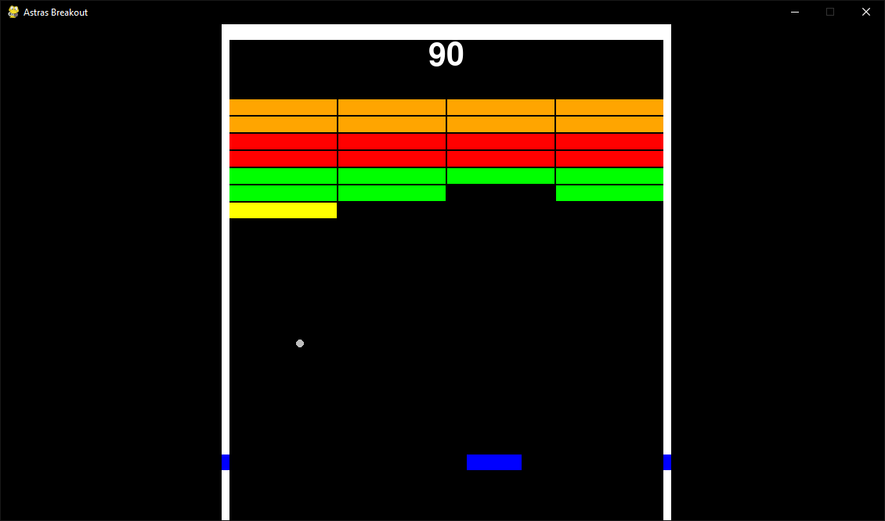

# Arkanoid Clone

A simple Arkanoid (Breakout) clone built with Python and Pygame. This project is a small practice exercise to demonstrate basic game development concepts using Pygame.

## Features
- Paddle controlled by the player
- Ball physics with collision detection (needs improvement)
- Breakable bricks (they need a lot of improvement too)
- Simple scoring system

## Installation

1. **Clone the repository:**
   ```bash
   git clone https://github.com/Jastreas/pygame_Arcanoid.git
   cd pygame_Arcanoid
   ```

2. **Install dependencies:**
   Make sure you have Python installed. Then, install Pygame:
   ```bash
   pip install pygame
   ```

## How to Play
- **Pause:** Press **P** for toggilng pause state (currently under development).
- **Move Paddle:** Use the **left** and **right** arrow keys to move the paddle.
- **Objective:** Break all the bricks without letting the ball fall below the paddle.

## Running the Game
```bash
python Game.py
```

## Contributing
This is a practice project, but feel free to fork the repo, make changes, and submit pull requests!

## License
This project is open source and available under the [MIT License](LICENSE).

